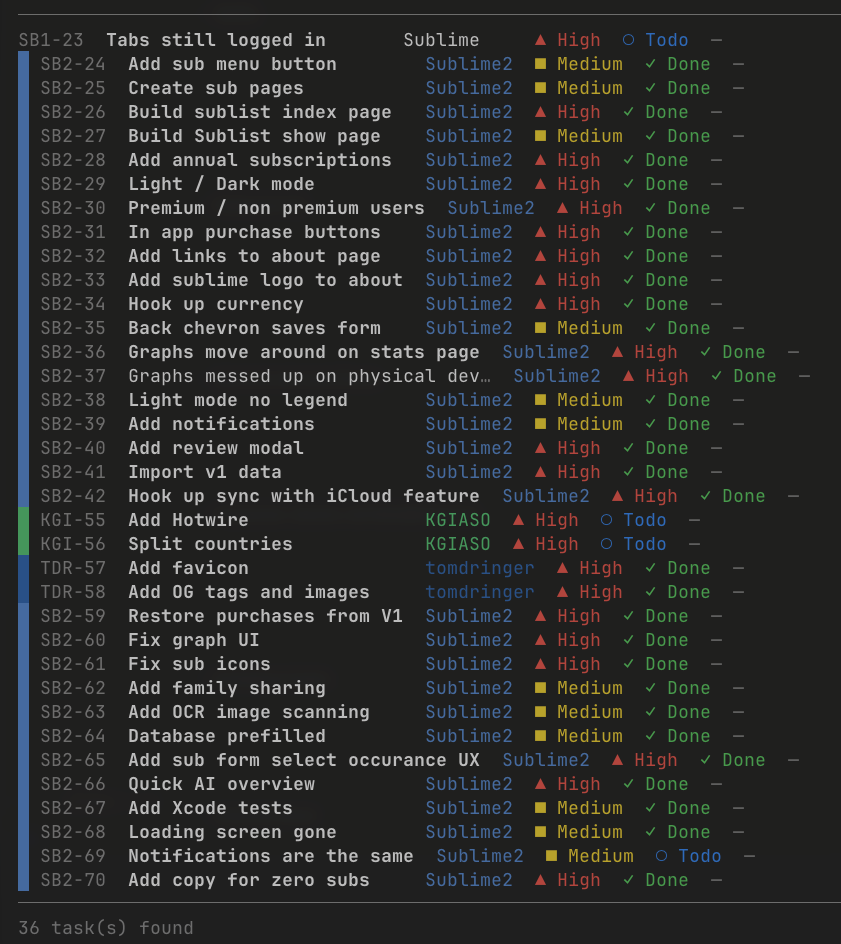
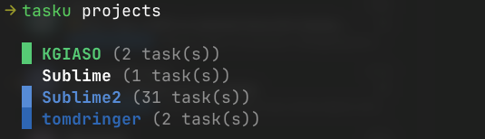
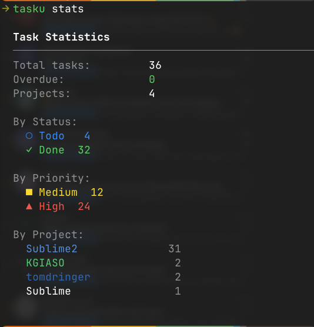
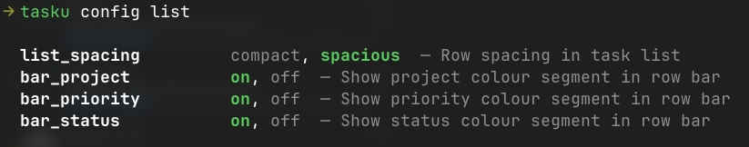

# Tasku

タスクリスト — a beautiful terminal task manager.

Colour-coded priorities, status tracking, project colours, SQLite persistence, and a clean CLI interface.



## Requirements

Ruby **>= 3.1.0**. Check your version:

```bash
ruby --version
```

If you need to install or upgrade Ruby, use [rbenv](https://github.com/rbenv/rbenv) or [asdf](https://asdf-vm.com):

```bash
# with rbenv
rbenv install 3.4.0
rbenv global 3.4.0

# with asdf
asdf install ruby 3.4.0
asdf global ruby 3.4.0
```

## Installation

```bash
gem install tasku
```

## Usage

Run `tasku` with no arguments to see the full command list:

```bash
tasku
```

```
tasku add              Create a new task
tasku list             List all tasks
tasku show ID          Show task details
tasku edit ID          Edit a task
tasku done ID          Mark a task as done
tasku delete ID        Delete a task
tasku stats            Show task statistics
tasku projects         List all projects
tasku categories       List all categories
tasku colour           Set a project colour
tasku config           Manage user preferences
tasku version          Show version
```

---

### Adding a task

```bash
tasku add --name "Write docs" --priority high --due 2026-07-15
```

Or use interactive mode:

```bash
tasku add -i
```

### Listing tasks

```bash
tasku list                          # all tasks
tasku list --status todo            # filter by status
tasku list --priority high          # filter by priority
tasku list --project "MyApp"        # filter by project
tasku list --overdue                # overdue tasks only
tasku list --sort due --order desc  # sorted
```

Each row displays a **colour bar** made up of three segments — project, priority, and status — giving you an instant visual read on every task.

### Editing a task

```bash
tasku edit 1 --name "New name" --priority urgent
tasku edit 1 --clear tags,hours
```

### Valid values

| Field    | Values                                                            |
|----------|-------------------------------------------------------------------|
| Priority | `none`, `low`, `medium`, `high`, `urgent`                         |
| Status   | `backlog`, `todo`, `in_progress`, `done`, `cancelled`, `archived` |

---

### Project colours

Assign a hex colour to any project. The colour appears in the row bar, the project name column, and the stats view.

```bash
tasku colour "MyApp" "#4A90D9"   # set a colour
tasku colour "MyApp"             # clear the colour
```



---

### Stats

```bash
tasku stats
```

Shows totals broken down by status, priority, and project. Projects are listed in their colour, sorted from most to fewest tasks.



---

### User preferences

```bash
tasku config list                        # show all preferences
tasku config get list_spacing            # get a value
tasku config set list_spacing spacious   # set a value
```



| Key            | Values           | Default   | Description                          |
|----------------|------------------|-----------|--------------------------------------|
| `list_spacing` | `compact`, `spacious` | `compact` | Row spacing in task list        |
| `bar_project`  | `on`, `off`      | `on`      | Show project colour segment in bar   |
| `bar_priority` | `on`, `off`      | `on`      | Show priority colour segment in bar  |
| `bar_status`   | `on`, `off`      | `on`      | Show status colour segment in bar    |

Preferences are saved to `~/.tasku/config.json`.

---

### Raw SQL

```bash
tasku --sql "SELECT * FROM tasks WHERE priority = 'high'"
```

---

## Development

```bash
git clone https://github.com/tomdringer/tasku.git
cd tasku
bundle install
ruby -Ilib exe/tasku list
```

To rebuild the gem locally:

```bash
gem build tasku.gemspec && gem install tasku-*.gem
```

## Introducing Mado

On October 1st Tasku's sister product Mado will be released. Mado is a terminal multiplexer, with multiple themes and plugins to make your journey building software a lot more pleasent. 
Tasku will have multiple plugins for Tasku, including projects, stats, workspaces etc. Wheather you want to use Tasku with or without Mado, both versions will still be maintained.
Please check https://nerimasoft.co.uk/mado.html for more info.

## License

MIT
